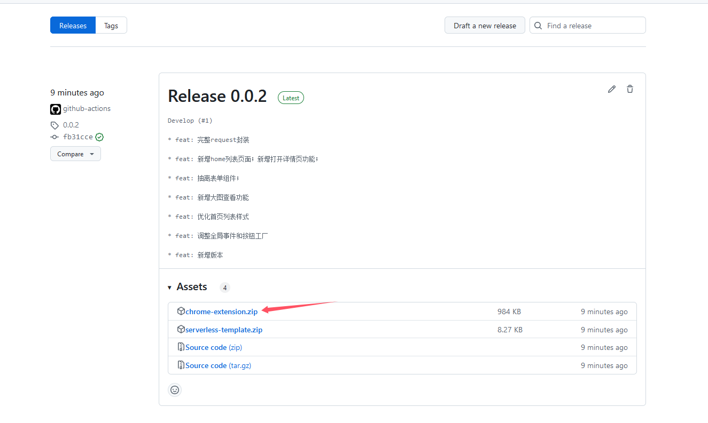
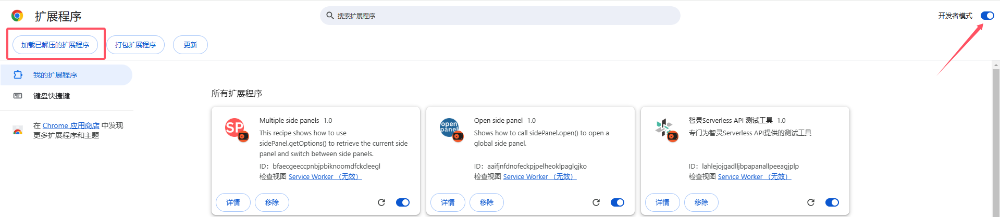
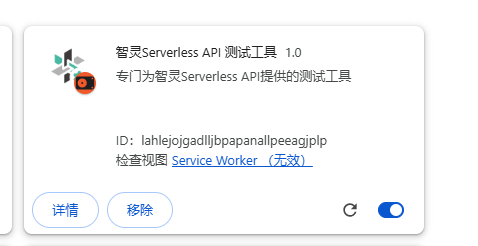
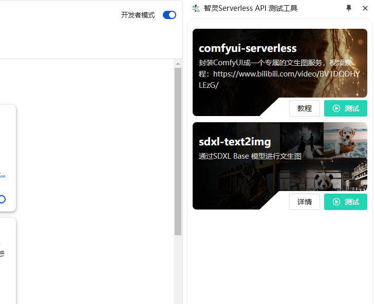

# serverless-template

官方Serverless模板仓库，附带谷歌浏览器测试用的插件

## 谷歌浏览器测试插件

首先我们需要下载插件，插件下载地址：[releases](https://github.com/datastone-spirit/serverless-template/releases)

下载最新的版本，也就是releases中最开头的版本，点击 **chrome-extension.zip** 下载压缩包。

下载后解压到本地，你会得到一个dist目录，里面就是插件的代码文件。

接着我们打开谷歌浏览器：**管理扩展程序** 页面，也就是：`chrome://extensions/` 页面。

开启右上角的开发者模式，此时左侧顶部会出现一些按钮，其中就有 **加载已解压的扩展程序** 按钮。

点击按钮，选择刚才解压的dist目录，然后点击 **添加** 按钮。

此时插件就安装成功了。

我们可以将其固定到浏览器的工具栏，这样就可以随时使用了，点击插件图标会开启侧边栏，里面有一些针对官方Serverless模板的测试工具。

