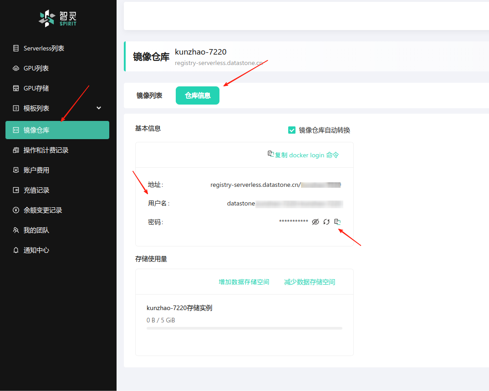
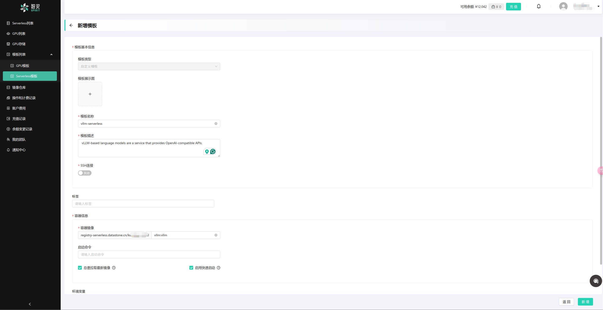
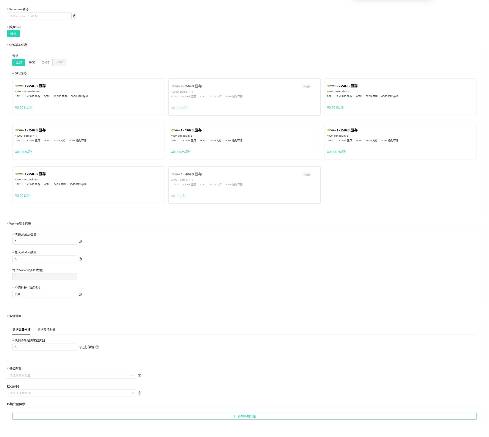
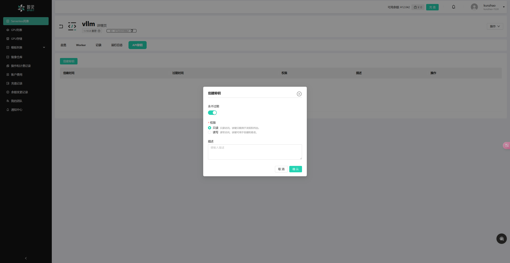
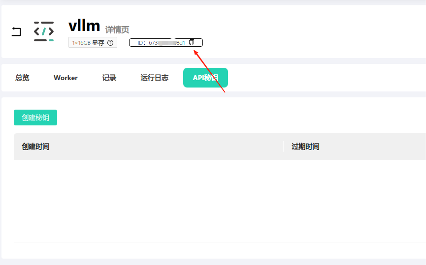

# vLLM Serverless 模板

[English Version](./README.md)

## 简介

这是一个在 Spirit serverless 平台上部署 serverless 服务的简单示例。本示例部署的 serverless 服务提供与 OpenAI GPT-3 API 兼容的接口。

## 前置条件

- Spirit 账号：您需要一个 Spirit 账号才能部署 serverless 服务。如果没有账号，可以在[这里](https://serverless.datastone.cn/)注册。

- Docker 和 Docker Compose：您需要在本地机器上安装 Docker 和 Docker Compose。可以从[这里](https://www.docker.com/products/docker-desktop)下载 Docker Desktop。

## 部署流程

如果您想在 Spirit 平台上部署 serverless 服务，需要执行以下步骤：

- 构建 serverless 服务的 Docker 镜像（详见 Dockerfile 说明）
- 将 Docker 镜像推送到 Spirit 平台
- 创建 serverless 服务模板
- 使用模板创建 serverless 服务并设置相关参数

### 构建 Docker 镜像

首先，您需要为 serverless 服务构建 Docker 镜像。项目根目录中的 Dockerfile 用于构建镜像。运行以下命令构建镜像：

```bash
registry=registry-serverless.datastone.cn tenant='{您的租户名称}' docker compose build vllm
```

> 注意：请使用正确的租户名称替换上述命令中的 `{您的租户名称}`。

运行上述命令将构建 serverless 服务的 Docker 镜像。镜像将被标记为 `registry-serverless.datastone.cn/{您的租户名称}/vllm:vllm`。

### Dockerfile 说明

这个 Dockerfile 设置了一个用于 vLLM（向量语言模型）服务的多阶段构建：

#### 第一阶段：模型构建器

第一阶段使用 `nicolaka/netshoot` 作为基础镜像，命名为 `model-builder`。这个阶段：

1. 安装 Git LFS（大文件存储）：
   - 下载 Git LFS 包
   - 解压并安装
   - 清理下载的压缩包

2. 使用 pip 安装 Hugging Face CLI 工具

3. 从 Hugging Face 下载特定模型（`phi-4-bnb-4bit`）到本地目录

#### 第二阶段：最终镜像

第二阶段使用支持 CUDA 的 Ubuntu 22.04 镜像（包含 Python 3.11 和 PyTorch 2.5.1），命名为 `vllm`。这个阶段：

1. 设置模型的工作目录
2. 从第一阶段复制下载的模型
3. 安装 Python 依赖
4. 复制源代码和启动脚本
5. 设置启动脚本执行权限
6. 设置默认启动命令

#### 主要特点

- 使用多阶段构建以减小最终镜像大小
- 集成 CUDA 支持以实现 GPU 加速
- 实现规范的模型下载和设置流程
- 遵循最佳实践，清理安装后的不必要文件
- 使用 `ARG BASE_URL` 实现灵活的基础镜像源配置


本 Dockerfile 旨在创建一个容器化环境，用于在生产环境中运行一个 serverless 服务，该服务将请求代理到后台运行的 vLLM 服务（使用 phi-4 模型）。


### 推送 Docker 镜像

在推送 Docker 镜像到 Spirit 镜像仓库之前，您需要登录到 Spirit 平台。运行以下命令：

```bash
docker login registry-serverless.datastone.cn
Username: 
Password:
```

请使用正确的用户名和密码登录 Spirit 镜像仓库。登录信息可以从 Spirit 平台获取，如下图所示：



> 注意：默认仓库容量为 5GB，如需更多空间，请点击"增加数据存储空间"按钮。由于快速启动转换需要，请确保有 2 倍镜像大小的可用空间。

登录成功并确保有足够的仓库容量后，可以使用以下命令推送 Docker 镜像：

```bash
docker push registry-serverless.datastone.cn/{your_tenant_name}/vllm:vllm
```

### 创建服务模板

将 Docker 镜像推送到 Spirit 镜像仓库后，需要为 serverless 服务创建模板。模板用于定义 serverless 服务，包括 Docker 镜像、环境变量和其他配置。

打开 Spirit 平台，导航至`"模板列表"/"Serverless 模板"`页面，点击"新建模板"按钮创建新模板。您可以参照下图填写模板信息：



- 为模板设置一个唯一的名称和易读的描述
- 确保镜像名称为 `vllm:vllm`，镜像标签的其他部分将由 Spirit 平台自动填充
- "总是拉取最新镜像"选项用于设置 serverless 服务在启动时是否始终拉取最新的 Docker 镜像，这在调试时特别有用
- "启用快速启动"选项用于启用 serverless 服务的快速启动功能，可以减少服务的冷启动时间。请确保启用此选项
- "环境变量"用于设置 serverless 服务的环境变量

- 点击"保存"按钮保存模板

### 创建 Serverless 服务

创建完模板后，您可以使用该模板创建 serverless 服务。打开 Spirit 平台，导航至"Serverless 列表"页面，点击"新建Serverless"按钮创建新服务。您可以在页面中设置以下选项：



- 为 serverless 服务设置唯一名称
- 选择 GPU 规格，例如：选择 `4090-4xmedium-8-1` 表示使用 1 块 NVIDIA RTX-4090 GPU，4核CPU和32GB内存
- 设置活动工作进程数和最大工作进程数。活动工作进程在服务启动时就会启动，无论是否有请求都会运行。最大工作进程数用于限制服务可以启动的工作进程数量，防止消耗过多资源
- 设置工作进程扩容策略，可以基于请求队列数量或请求等待时间。当并发请求满足策略条件时，服务会启动新的工作进程处理请求
- 空闲时间用于设置工作进程空闲后保持运行的时间。超过这个时间后，空闲的工作进程将被终止
- 从模板下拉列表中选择之前创建的模板
- 点击"保存"按钮保存服务

保存后，serverless 服务将被创建并启动。您可以点击服务名称查看详细信息页面，包括服务状态、日志等信息。

## 如何使用

### 创建 Serverless 密钥

点击之前创建的 serverless 服务名称。在服务详情页面，找到"API密钥"标签页，点击切换到该标签页，然后点击"新建密钥"按钮创建密钥：



点击"确定"按钮后，密钥将被创建。请务必将密钥值保存在安全的地方，因为它不会再次显示。

### 调用 Serverless 服务

您可以使用以下 curl 命令测试 serverless 服务：

```bash
curl https://api-serverless.datastone.cn/v1/chat/completions \
    -H "Content-Type: application/json" -H "Authorization: {severless-id}-{serverless-key}" \
    -d '{
        "model": "/workspace/vllm/phi-4-bnb-4bit",
        "messages": [
            {"role": "system", "content": "You are a helpful assistant."},
            {"role": "user", "content": "Write a python game program"}
        ]
    }' 
```

> 注意：请使用正确的 serverless-id 和 serverless-key 替换上述命令中的 `{severless-id}` 和 `{serverless-key}`。
> 你可以在 serverless 服务的详情页面找到 serverless-id 如下图所示。


上述命令将向 serverless 服务发送请求，生成对应的文本补全内容。服务将返回针对给定消息的补全结果。